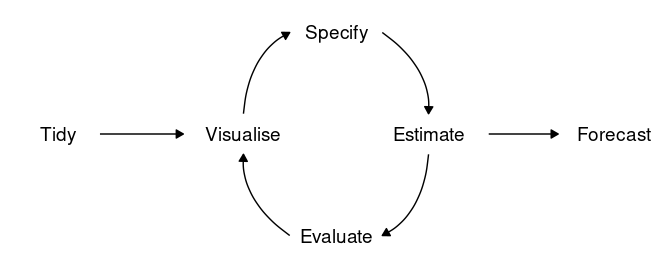

```{r setup, include=FALSE}
knitr::opts_chunk$set(echo = TRUE)
```

## 5.1 A Tidy Forecasting Workflow



#### __Data Prep (Tidy)__

* Review the data to ensure correct format
* Pre-process using `tsibble` or `tidyverse` packages

__Example__
Modeling GDP per capita over time requires transformation
```{r}
gdppc <- global_economy %>%
  mutate(GDP_per_capita = GDP / Population)
```

#### __Plot the Data (Visualize)__

* Visualization increases understanding of the data
* Identify patterns and specify model

```{r}
gdppc %>%
  filter(Country == 'Sweden') %>%
  autoplot(GDP_per_capita) +
  labs(y="$US", title = "GDP per capita for Sweden")
```

#### __Define a Model (Specify)__

